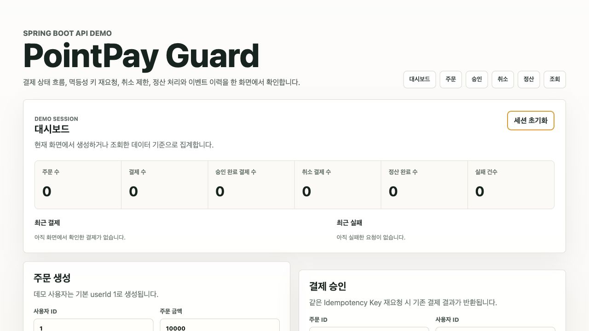
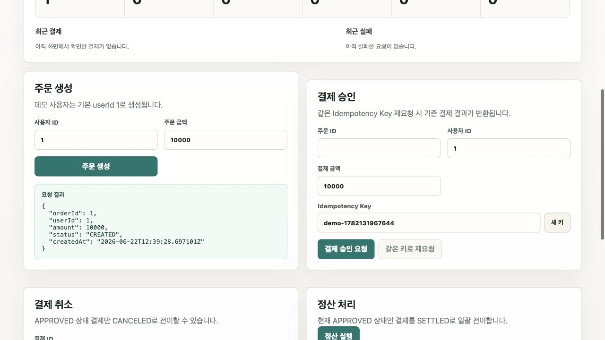
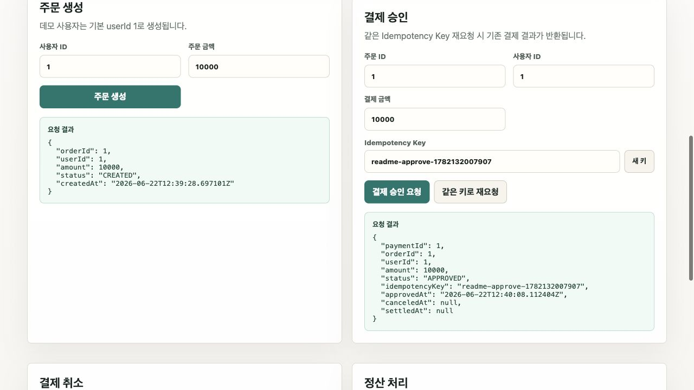
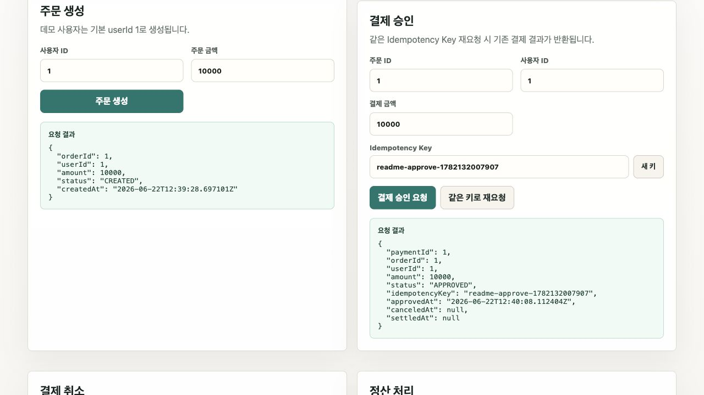
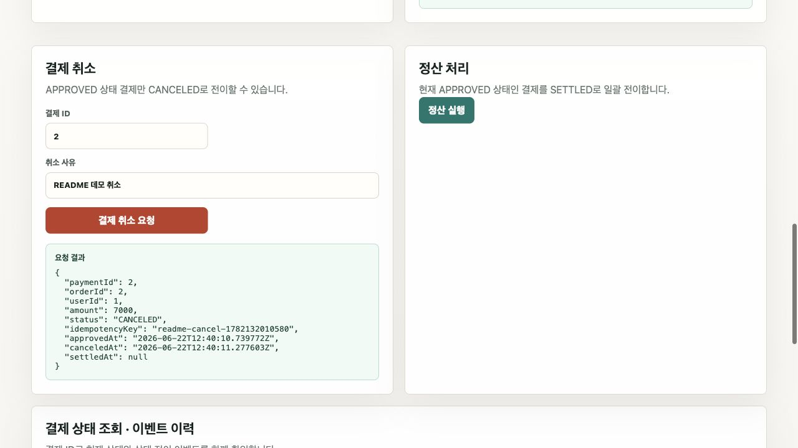
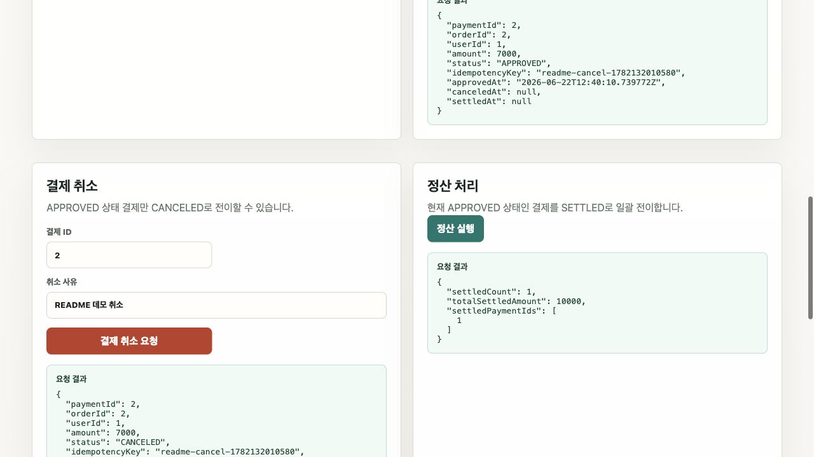
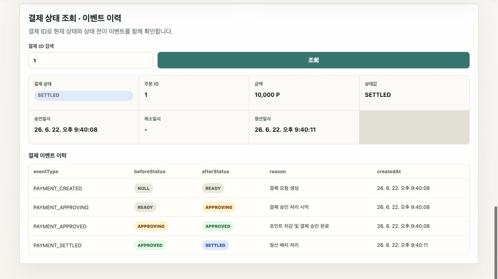

# PointPay Guard

Spring Boot 백엔드와 React 데모 프론트엔드로 구성된 포인트 결제 상태 흐름 데모입니다. 핵심은 결제 승인 멱등성, 결제 취소 상태 전이, 정산 처리, 이벤트 이력 조회를 한 화면에서 확인하는 것입니다.

## 백엔드 실행

```bash
cd backend
docker compose up -d
./gradlew bootRun --args='--spring.profiles.active=local'
```

기본 H2 프로필로 실행할 수도 있지만 Redis가 필요하므로 로컬 데모에서는 `docker compose up -d` 후 `local` 프로필 실행을 권장합니다.

로컬 DB/Redis 접속값은 환경변수로 덮어쓸 수 있습니다. 예시 값은 `backend/.env.example`에 있으며, 실제 `.env` 파일은 `.gitignore`에 포함되어 커밋되지 않습니다.

앱 시작 시 데모 사용자와 지갑이 자동 생성됩니다.

```text
userId: 1
initial balance: 100000
```

Docker 없이 화면 데모만 빠르게 띄울 때는 Redis 대신 JVM 메모리 기반 멱등성/락을 쓰는 `demo` 프로필을 사용할 수 있습니다.

```bash
cd backend
./gradlew bootRun --args='--spring.profiles.active=demo --server.port=8081'
```

## 프론트엔드 실행

```bash
cd frontend
npm install
npm run dev
```

프론트엔드는 [http://localhost:5173](http://localhost:5173)에서 실행됩니다. Vite proxy가 `/api` 요청을 `http://localhost:8080`으로 전달하므로 백엔드 CORS 설정을 따로 변경하지 않습니다.

위 `demo` 백엔드를 8081에 띄웠다면 프론트도 데모 스크립트로 실행할 수 있습니다.

```bash
cd frontend
npm run dev:demo
```

이 경우 화면은 [http://localhost:5174](http://localhost:5174)에서 열리고, Vite proxy가 `/api` 요청을 `http://localhost:8081`로 전달합니다.

## 실제 백엔드 API

| 기능 | Method | Endpoint | Request |
| --- | --- | --- | --- |
| 주문 생성 | `POST` | `/api/orders` | `{ "userId": 1, "amount": 10000 }` |
| 결제 승인 | `POST` | `/api/payments/approve` | `{ "orderId": 1, "idempotencyKey": "demo-key" }` |
| 결제 취소 | `POST` | `/api/payments/{paymentId}/cancel` | `{ "reason": "사용자 요청" }` |
| 결제 상태 조회 | `GET` | `/api/payments/{paymentId}` | 없음 |
| 결제 이벤트 이력 조회 | `GET` | `/api/payments/{paymentId}/events` | 없음 |
| 정산 실행 | `POST` | `/api/settlements/run` | 없음 |

백엔드에는 주문/결제 목록 조회나 전체 집계 API가 없습니다. 프론트 대시보드는 현재 브라우저 세션에서 생성, 조회, 처리한 응답을 기준으로 표시합니다.

## 예시 테스트 흐름

1. 주문 생성: 사용자 ID `1`, 주문 금액 `10000`으로 주문을 생성합니다.
2. 결제 승인: 생성된 주문 ID와 새 Idempotency Key로 승인을 요청합니다.
3. 중복 요청 테스트: 같은 Idempotency Key로 재요청 버튼을 눌러 기존 결제 결과가 반환되는지 확인합니다.
4. 결제 상태 조회: 결제 ID로 상태, 주문 ID, 금액, 승인일시를 확인합니다.
5. 결제 취소: 승인된 결제 ID와 취소 사유로 취소를 요청합니다.
6. 이벤트 이력 조회: 같은 결제 ID로 `beforeStatus`, `afterStatus`, `eventType`, `reason`, `createdAt`을 확인합니다.
7. 정산 실행: 취소하지 않은 `APPROVED` 결제를 만든 뒤 정산을 실행해 `SETTLED` 전이를 확인합니다.

## 프론트엔드 화면

- 대시보드: 주문 수, 결제 수, 승인 완료, 취소, 정산 완료, 실패 건수
- 주문 생성
- 결제 승인 및 같은 Idempotency Key 재요청
- 결제 취소
- 정산 처리
- 결제 상태 조회
- 결제 이벤트 이력 조회

## 데모 화면 캡처

아래 이미지는 `demo` 프로필 백엔드와 `npm run dev:demo` 프론트엔드를 실행한 뒤 실제 화면에서 주문 생성, 승인, 중복 요청, 취소, 정산, 이벤트 조회 흐름을 진행하며 캡처한 상태입니다.

### 1. 초기 대시보드

브라우저 세션에 아직 확인한 주문/결제가 없는 상태입니다. 이후 화면에서 발생한 API 응답을 기준으로 대시보드 집계가 채워집니다.



### 2. 주문 생성 완료

기본 데모 사용자 `userId=1`로 주문을 생성하면 주문 ID, 금액, 주문 상태가 응답으로 표시됩니다.



### 3. 결제 승인 완료

생성된 주문 ID와 Idempotency Key로 결제를 승인하면 `APPROVED` 상태의 결제 응답이 표시됩니다.



### 4. 같은 Idempotency Key 재요청

같은 Idempotency Key로 다시 요청해도 새 결제를 만들지 않고 기존 결제 결과를 반환합니다.



### 5. 결제 취소 완료

`APPROVED` 상태인 다른 결제를 취소하면 `CANCELED` 상태로 전이되고 취소 사유와 취소 시각이 응답에 남습니다.



### 6. 정산 처리 완료

취소되지 않은 `APPROVED` 결제는 정산 실행 시 `SETTLED` 상태로 일괄 전이됩니다.



### 7. 결제 이벤트 이력 조회

결제 ID로 조회하면 `READY -> APPROVING -> APPROVED -> SETTLED` 상태 전이와 각 이벤트 사유를 한 번에 확인할 수 있습니다.



## 연동 시 주의할 점

- 결제 승인 API는 현재 `orderId`, `idempotencyKey`만 받습니다. 프론트의 사용자 ID와 결제 금액 입력은 응답 검증용이며 요청 바디에는 포함하지 않습니다.
- 정산 후 결제는 `SETTLED` 상태가 되며, 백엔드 도메인 규칙상 취소할 수 없습니다.
- 대시보드 전체 집계가 필요하면 백엔드에 목록 조회 또는 집계 API를 추가해야 합니다.
- 로컬 실행용 기본 계정과 비밀번호는 데모 편의를 위한 값입니다. 외부에 노출되는 환경에서는 `POINTPAY_DB_PASSWORD` 등 환경변수로 별도 값을 지정해야 합니다.
